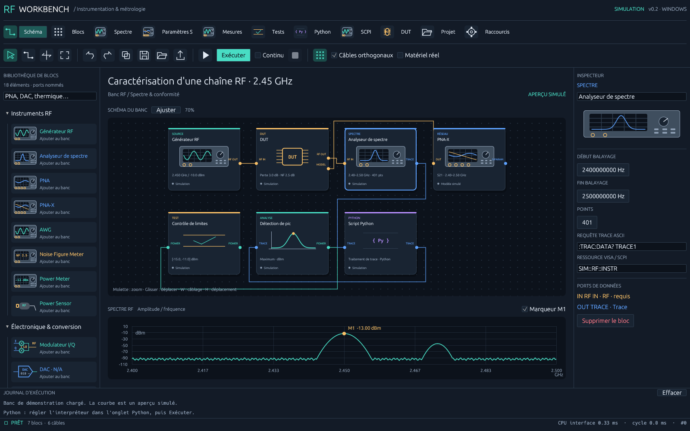

# RF Workbench

Première base de laboratoire graphique RF et hyperfréquence en **Rust**, avec scripts **Python**. Application native pour ingénieurs d'instrumentation et de métrologie, inspirée du principe des instruments virtuels et des schémas de flux. Ce prototype est indépendant de LabVIEW.



**Version 0.2 :** 18 blocs illustrés, dont PNA/PNA-X, AWG, modulateur I/Q, DAC/CAN, capteurs et thermique. Barre d'outils, câblage `W` avec parcours personnalisés, raccourcis configurables, catalogue DUT et vues paramètres S / formes d'onde. Voir le [guide 0.2](docs/V0.2.md), ses modèles et ses limites matérielles.

## Essayer sous Windows

La livraison locale contient `dist/windows/rf-workbench.exe`. Ouvrir `dist/windows/Lancer RF Workbench.cmd` pour lancer le banc dans son dossier de travail. Aucun compilateur Rust ni runtime VISA n'est nécessaire pour la simulation.

1. Ouvrir l'onglet **Python**, puis choisir le chemin de `python.exe` (Python 3.10 ou ultérieur). Le lanceur local sélectionne l'interpréteur disponible sur cette machine.
2. Dans **Schéma du banc**, cliquer **Exécuter**. La chaîne par défaut produit une porteuse à 2,45 GHz, avec -10 dBm à la source et 3 dB de perte DUT. Le pic simulé doit être -13 dBm.
3. **Acquisitions** affiche la trace, son pic et son nombre de points. Le survol donne fréquence et amplitude. **Exporter CSV** conserve l'indication `simulated`.
4. **Tests → Lancer les autotests** vérifie le logiciel ; **Tester le banc** exécute les contrôles de limites du schéma. **Projet** propose aussi des démonstrations PNA-X, I/Q et thermique/puissance.
5. Ajouter des blocs dans la bibliothèque. Cliquer une sortie puis une entrée pour les relier. Déplacer un bloc par glisser-déposer, zoomer avec la molette, déplacer le fond, ajuster le cadrage. Clic droit sur un bloc ou au milieu d'un câble pour le retirer. Annuler/rétablir : Ctrl+Z / Ctrl+Y. Supprimer : Suppr. Exécuter : F5.
6. L'inspecteur permet de modifier les paramètres et les chemins de sauvegarde. Le projet JSON conserve les blocs, leurs paramètres, leurs positions, les câbles et les scripts. Les entrées non reliées peuvent être sauvegardées, mais empêchent l'exécution.

À l'ouverture, la courbe est explicitement un **aperçu simulé**. Aucun résultat de test n'est présenté comme acquis avant exécution. En continu, le worker réexécute un instantané du schéma ; les modifications prennent effet au démarrage suivant.

## Python pour les métrologues

Dans un bloc Python, `trace` est un dictionnaire contenant `frequency_hz`, `amplitude_dbm` et `simulated`. Le script doit fournir `output`, une trace de même structure. Les deux vecteurs doivent avoir la même longueur, au moins deux points, des valeurs finies et des fréquences strictement croissantes.

```python
rm = ResourceManager()
instrument = rm.open_resource("SIM::RF::INSTR")
identity = instrument.query("*IDN?")

output = dict(trace)
output["amplitude_dbm"] = [level + 0.5 for level in trace["amplitude_dbm"]]
```

Choisir le bloc Python dans le schéma, puis **Éditer le script Python**. **Appliquer au bloc sélectionné** enregistre le script dans le projet. **Exécuter sur la trace** permet de l'essayer indépendamment. L'exemple de compensation de câble est disponible dans l'éditeur et dans `python/examples/`.

Les appels `.query()` et `.write()` passent par les sessions Rust : Python n'a besoin ni de PyVISA ni d'un pilote supplémentaire pour utiliser les transports déjà intégrés. NumPy/SciPy peuvent être installés dans l'environnement Python choisi. Le processus est interrompu après 5 secondes, sauf le temps d'une requête d'instrument déjà en cours. Les erreurs arrivent dans le journal. `print()` est dirigé vers stderr, actuellement non affiché, pour préserver le protocole JSON. Python s'exécute avec les permissions du compte, **sans sandbox de sécurité**. Le mode simulation protège les appels de la passerelle, pas des sockets ou bibliothèques qu'un script utiliserait directement.

## Instruments

| Transport | Fonctionnement dans cette version |
| --- | --- |
| `SIM::RF::INSTR` | Simulateur déterministe : `*IDN?`, `*OPC?`, `:FREQ`, `:POW`, `:OUTP`, `SYST:ERR?` |
| `TCPIP::hôte::5025::SOCKET` | SCPI TCP natif, terminaison LF/CRLF, délai de 2 s, lecture texte et blocs binaires IEEE 488.2 |
| `USB0::…::INSTR`, `GPIB0::…::INSTR`, `ASRL1::INSTR` | Adaptateur VISA dynamique, runtime constructeur nécessaire |
| `TCPIP0::hôte::inst0::INSTR`, `TCPIP0::hôte::hislip0::INSTR` | Délégué au runtime VISA, selon ses capacités |

Activer **Matériel réel** pour autoriser les sessions physiques. Configurer une ressource distincte pour le générateur et l'analyseur. Le moteur refuse les chaînes mélangeant source réelle et acquisition simulée. L'adaptateur VISA utilise `viOpenDefaultRM`, `viOpen`, `viSetAttribute`, `viWrite`, `viRead` et `viClose` ; le runtime est chargé seulement à l'ouverture d'une session VISA. `RF_WORKBENCH_VISA` permet de choisir sa bibliothèque. Il ne s'agit pas d'une réimplémentation complète de VISA.

Le profil d'analyseur initial emploie `:FREQ:STAR`, `:FREQ:STOP`, `:SWE:POIN`, `:FORM ASC`, `:INIT:CONT OFF`, `:INIT:IMM`, `*OPC?` et une requête de trace configurable (`:TRAC:DATA? TRACE1` par défaut). Vérifier le manuel du modèle et l'unité dBm de la trace. Le générateur utilise `:FREQ`, `:POW`, `:OUTP ON/OFF`. En simulation, la perte DUT est calculée ; sur un banc physique, le DUT doit être réellement câblé. Aucune commande de routage physique n'est générée par les câbles du schéma.

À l'arrêt, à une erreur et à la fin d'une exécution simple, le moteur tente de couper les sorties RF qu'il a activées, puis ferme les sessions. Une perte de communication peut empêcher la confirmation de cette coupure ; elle est signalée dans le journal. Un arrêt reste coopératif entre opérations, et une résolution DNS système peut dépasser le délai TCP. La découverte automatique, les profils par constructeur et la calibration métrologique ne sont pas encore intégrés.

## Développement

Installer Rust 1.90 avec la cible native. Sous Windows, le parcours standard est MSVC avec Visual Studio Build Tools (C++ et SDK Windows). Le projet a également été compilé localement avec une chaîne GNU portable. Sous Linux, installer les bibliothèques X11/Wayland/OpenGL indiquées dans la CI. Sous macOS, installer les outils Xcode.

```powershell
cargo run -p rf-workbench
cargo test --workspace --locked
cargo clippy --workspace --all-targets --locked -- -D warnings
cargo fmt --all -- --check
cargo test -p rf-runtime --test python_integration --locked -- --ignored
cargo build --release -p rf-workbench --locked
```

Les tests d'intégration Python exigent un interpréteur ; ils sont exclus de la commande Rust seule et exécutés explicitement par la CI. `RF_WORKBENCH_TEST_PYTHON` permet d'en choisir le chemin. `RF_WORKBENCH_PYTHON` configure celui de l'application.

```powershell
cd python
uv sync --locked
uv run pytest --cov --cov-branch
uv run ruff check .
uv run ruff format --check .
uv run ty check
uv run basedpyright
```

`scripts/check.ps1 -Build` regroupe les contrôles sur Windows ; le Makefile expose les commandes sur les environnements disposant de Make. Le fichier `Cargo.lock` et `python/uv.lock` figent les dépendances. La CI prépare Windows, Linux et macOS, sans prétendre que ces trois jobs ont déjà été exécutés à distance.

L'exécutable propose `--self-test`, `--headless-run`, `--benchmark` (1 000 cycles simulés sans Python) et `--python-smoke --python chemin/python.exe`. Les mesures de performance de cette livraison sont consignées dans `docs/VALIDATION.md`.

## Architecture et plateformes

Voir [ARCHITECTURE.md](docs/ARCHITECTURE.md) et [ROADMAP.md](docs/ROADMAP.md). L'interface utilise [egui/eframe](https://docs.rs/eframe/0.33.0/eframe/), avec rendu GPU OpenGL natif. Le cœur de données et de graphes ne dépend d'aucune interface graphique. Windows est la plateforme validée localement. Linux/macOS ont une configuration CI ; iOS/Android restent un travail de portage, d'adaptation tactile et d'empaquetage. Le noyau partageable ne suffit pas à garantir qu'une application mobile fonctionne.

Les APIs ont été comparées à [PyVISA](https://pyvisa.readthedocs.io/en/latest/introduction/resources.html) et aux bindings existants [visa-rs](https://docs.rs/visa-rs/latest/visa_rs/). Le petit adaptateur dynamique évite de rendre le SDK constructeur obligatoire pour compiler et lancer le prototype ; l'ABI suit les [en-têtes VISA](https://github.com/wpilibsuite/ni-libraries/blob/main/src/include/visa/visa.h). Le matériel physique et l'adaptateur constructeur n'ont pas été validés sur un instrument dans cette session.

Licence MIT.
