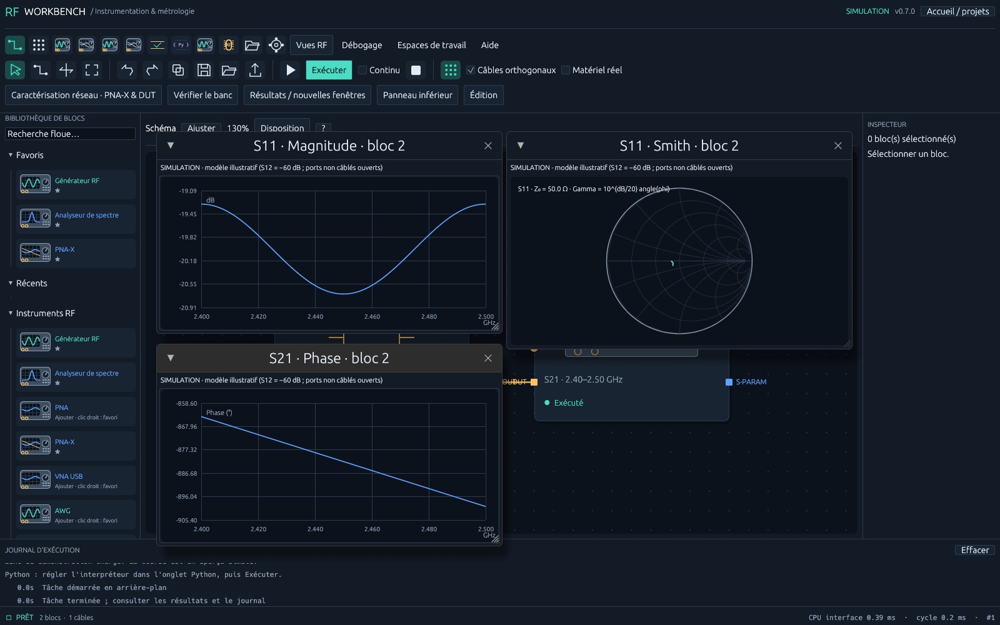
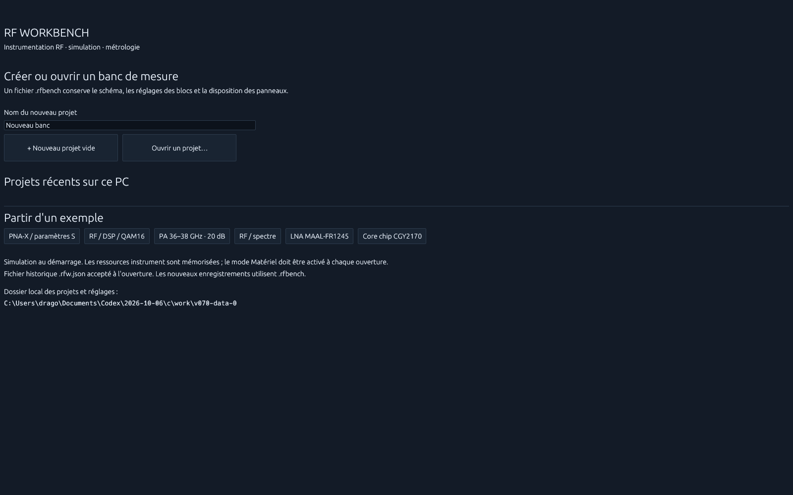
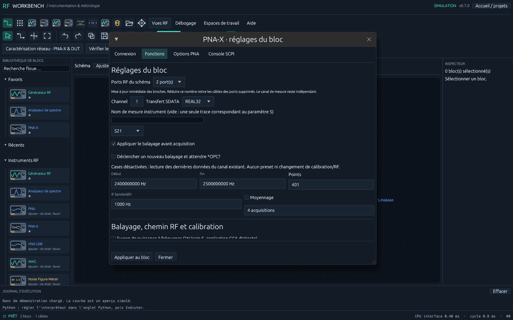

# RF Workbench

**Windows : [Télécharger directement rf-workbench.exe](https://github.com/Citroz31/rf-workbench/releases/latest/download/rf-workbench.exe)** · **[ZIP portable complet](https://github.com/Citroz31/rf-workbench/releases/latest/download/RF-Workbench-Windows-x64-portable.zip)** · [Page des téléchargements](https://github.com/Citroz31/rf-workbench/releases/latest)

Application locale Windows x64, sans installation, sans compte et sans serveur. Double-cliquer sur `rf-workbench.exe` ; Python et VISA sont facultatifs pour les exemples simulés. Le manifeste Windows impose `asInvoker` : aucune élévation demandée par le programme. Données enregistrées dans le profil utilisateur (`%LOCALAPPDATA%/RF Workbench`), indépendamment du dossier de lancement. Aucun compte, télémétrie ou téléchargement automatique. L'exécutable est actuellement non signé : une validation IT peut être nécessaire selon la politique de l'entreprise. Voir [la procédure portable](docs/PORTABLE.md).

**Version 0.7 :** vrais projets indépendants `.rfbench` avec accueil et fichiers récents, remise à zéro du moteur, vérification des bandes RF et puissances déclarées. PNA-X **N5245B** : sweep fréquence/puissance, IFBW, matrice S jusqu'à 4 ports, CalSet existant, exports et plusieurs fenêtres dB/phase/Smith. Panneau inférieur masquable. Fixtures `.s2p`, Reverse entrée/sortie, mesure 2×Thru et extraction native IFFT/gating/FFT inspirée de scikit-RF P370 NZC. [Fonctions, méthode et limites 0.7](docs/V0.7.md) · [Guide PDF](docs/Guide-utilisateur.pdf).



Le 2×Thru nécessite une grille harmonique proche de DC et des hypothèses de fixtures passives/réciproques de longueurs électriques égales. Une bande 36–38 GHz seule est refusée. Le calcul natif est testé contre scikit-RF ; il ne constitue ni l'AFR propriétaire Keysight ni une certification IEEE. Aucun N5245B physique n'a été connecté pour cette livraison.

Les fonctions 0.6 restent présentes : câblage W avec aimantation, ports RF/DC, catalogue MAAL-FR1245 et CGY2170YHV/C1, alimentations E3631A/E36313A. [Historique 0.6](docs/V0.6.md).

**Version 0.5.1 :** livraison portable simplifiée, dossier de données utilisateur, manifeste Windows sans élévation et publication automatisée des exécutables dans Releases. Le ZIP place `rf-workbench.exe` directement à la racine, avec le guide PDF et les exemples. Le dépôt Code contient les sources ; les applications compilées sont dans **Releases**.

Première base de laboratoire graphique RF et hyperfréquence en **Rust**, avec scripts **Python**. Application native pour ingénieurs d'instrumentation et de métrologie, inspirée du principe des instruments virtuels et des schémas de flux. Ce prototype est indépendant de LabVIEW.



**Version 0.5 :** démarrage par nouveau banc / ouverture, fichiers **.rfbench**, panneaux et graphiques redimensionnables à la souris, fenêtres de configuration des instruments. Découverte VISA avec identification, liste et adresse manuelle ; PNA/PNA-X avec canal et trace, acquisition binaire REAL32/64, lecture des classes autorisées et FDATA d'applications existantes. Voir les [fonctions et limites 0.5](docs/V0.5.md), le [guide utilisateur PDF à jour](docs/Guide-utilisateur.pdf) et les [exemples de projets](examples/).



L'exemple PA couvre 36–38 GHz et un gain petit signal de 20 dB. Le guide prépare une mesure **OP1dB ≈ 34 dBm** (Pin1dB ≈ 15 dBm) et l'objectif 40 dBm / 10 W. Le projet livré simule seulement le petit signal ; les courbes de compression du guide sont synthétiques. Aucun instrument physique n'a été validé sur cet environnement.

**Version 0.4 :** 45 nouvelles opérations RF/DSP/HAL, soit 63 types de blocs. Vue dockable RF/DSP avec I/Q, constellation, PSD, waterfall et mesures ; banc QAM16/AWGN/Viterbi/BER ; filtres, synchronisation, modems, codes canal, calibration et unités. HAL priorisant VISA GPIB/USB, découverte, profils typés, RAW/TCP/UDP natifs, streaming SPSC et adaptateurs Python optionnels SDR/audio/ZMQ/HDF5/Parquet. Voir le [guide et la matrice de capacités 0.4](docs/V0.4.md) et le [rapport de validation](docs/VALIDATION.md).


Pour l'essayer : **RF / DSP → Charger QAM16 / AWGN / Viterbi → Exécuter**. La simulation fonctionne sans SDK. Les algorithmes sont des profils de recherche ; les pilotes nécessitent les runtimes correspondants. PTP/GPSDO/MIMO complet, haut débit sans perte et validation sur instruments physiques restent à développer/valider.

**Version 0.3 :** éditeur avec sélection multiple, recherche floue/favoris/récents, alignements, routage autour des blocs, copier/coller et annotations. Graphe et analyses dockables : spectre, waterfall, constellation, Smith, eye diagram et chronogramme. Debug par bloc avec sondes et breakpoints, layouts et espaces sauvegardables, thème clair/contraste/FR-EN, aide globale et 18 fiches de blocs. Voir le [guide Studio 0.3](docs/V0.3.md) et le [rapport de validation](docs/VALIDATION.md).

Les 18 blocs illustrés de la [version 0.2](docs/V0.2.md), dont PNA/PNA-X, AWG, modulateur I/Q, DAC/CAN, capteurs et thermique, restent disponibles avec leurs ports typés et leurs modèles simulés.

## Essayer sous Windows

Télécharger le **[ZIP portable complet](https://github.com/Citroz31/rf-workbench/releases/latest/download/RF-Workbench-Windows-x64-portable.zip)** et extraire entièrement son contenu dans un dossier utilisateur, ou télécharger **[l'exécutable seul](https://github.com/Citroz31/rf-workbench/releases/latest/download/rf-workbench.exe)**. Double-cliquer sur `rf-workbench.exe` ; aucun CMD, compilateur Rust ou runtime VISA ne doit être installé pour essayer PNA-X, PA et QAM16 en simulation. Le paquet contient également le PDF et les projets exemples.

Le bouton **Code → Download ZIP** contient les sources, sans exécutable. Les anciennes archives 0.5.0 utilisaient un sous-dossier `rf-workbench-windows` et un lanceur CMD facultatif. La livraison 0.5.1 place directement l'application à la racine du ZIP.

Le mode simulation fonctionne hors ligne. Les scripts Python et pilotes sont optionnels ; sélectionner un interpréteur Python déjà autorisé si nécessaire. Les instruments GPIB/USB nécessitent un runtime VISA x64 autorisé. Aucun service ou règle de pare-feu ne sont installés par le programme. Avec les sources, lancer `cargo run -p rf-workbench` après installation de Rust et des outils de compilation.

1. À l'accueil, choisir **PNA-X / paramètres S**, **PA 36-38 GHz** ou **RF / DSP / QAM16** pour essayer une simulation sans dépendance supplémentaire. Les blocs Python sont facultatifs : pour en utiliser un, choisir un `python.exe` autorisé (Python 3.10 ou ultérieur) dans l'onglet **Python**.
2. Dans **Accueil / projets**, créer un banc ou ouvrir un exemple. Dans **Schéma**, cliquer **Exécuter**. La chaîne par défaut produit une porteuse à 2,45 GHz, avec -10 dBm à la source et 3 dB de perte DUT. Le pic simulé doit être -13 dBm.
3. **Spectre** affiche la trace, son pic et son nombre de points. Le survol donne fréquence et amplitude. L'export CSV, accessible dans **Projet** ou avec Ctrl+E, conserve l'indication `simulated`.
4. **Tests → Lancer les autotests** vérifie le logiciel ; **Tester le banc** exécute les contrôles de limites du schéma. **Projet** propose aussi des démonstrations PNA-X, I/Q et thermique/puissance.
5. Ajouter des blocs dans **Blocs** ou la palette. W active le câblage avec un curseur croix : cliquer une broche source puis une cible compatible ; la prévisualisation est aimantée à proximité du pin ; cliquer le fond avant la destination pour ajouter des coudes. Échap annule. Déplacer un bloc par glisser-déposer en sélection (V), zoomer avec la molette, déplacer le canevas (H), ajuster le cadrage (F). Clic droit sur un bloc ou un câble pour le retirer. Annuler/rétablir : Ctrl+Z / Ctrl+Y. Supprimer : Suppr. Exécuter : F5. **Raccourcis** (Ctrl+K) permet plusieurs combinaisons par action.
6. L'inspecteur permet de modifier les paramètres et d'ouvrir **Configurer l'instrument…**. Ctrl+S / Ctrl+O ouvrent les fenêtres de sauvegarde/ouverture. Le fichier **.rfbench** conserve les blocs, leurs paramètres, leurs positions, les câbles, leurs parcours et les scripts. Les entrées requises non reliées peuvent être sauvegardées, mais empêchent l'exécution.
7. **Disposition** place chaque analyse à droite, en bas ou dans une fenêtre flottante. Le fichier `.rfbench` conserve le banc actif, son layout, cadrage et ses fenêtres. **Espaces de travail → Enregistrer les préférences** conserve thème, favoris et dispositions ; les projets sont indépendants et les résultats/historiques sont remis à zéro au changement de fichier. Ce panneau propose également thème clair, contraste, taille du texte et langue.
8. **F6** démarre le debug simulé, **F10** exécute un bloc, **F8** continue. Breakpoints, sondes et commentaires sont dans l'inspecteur. **F1** ouvre le guide, **F2** la fiche du bloc. Le debug refuse les ressources physiques et n'effectue pas de pas à pas dans les lignes Python.

Le panneau inférieur est masqué par défaut ; le menu **Panneau inférieur** permet de l'ouvrir sur le spectre ou les paramètres S. Une éventuelle courbe initiale est explicitement un **aperçu simulé**. Aucun résultat de test n'est présenté comme acquis avant exécution. En continu, le worker réexécute un instantané du schéma ; les modifications prennent effet au démarrage suivant.

## Python pour les métrologues

Dans un bloc Python, `trace` est un dictionnaire contenant `frequency_hz`, `amplitude_dbm` et `simulated`. Le script doit fournir `output`, une trace de même structure. Les deux vecteurs doivent avoir la même longueur, au moins deux points, des valeurs finies et des fréquences strictement croissantes.

```python
rm = ResourceManager()
instrument = rm.open_resource("SIM::RF::INSTR")
identity = instrument.query("*IDN?")

output = dict(trace)
output["amplitude_dbm"] = [level + 0.5 for level in trace["amplitude_dbm"]]
```

Choisir le bloc Python dans le schéma, puis **Éditer le script Python**. **Appliquer au bloc sélectionné** enregistre le script dans le projet. **Exécuter sur la trace** permet de l'essayer indépendamment. L'exemple de compensation de câble est disponible dans l'éditeur et dans `python/examples/`.

Les appels `.query()` et `.write()` passent par les sessions Rust : Python n'a besoin ni de PyVISA ni d'un pilote supplémentaire pour utiliser les transports déjà intégrés. NumPy/SciPy peuvent être installés dans l'environnement Python choisi. Le processus est interrompu après 5 secondes, sauf le temps d'une requête d'instrument déjà en cours. Les erreurs arrivent dans le journal. `print()` est dirigé vers stderr, actuellement non affiché, pour préserver le protocole JSON. Python s'exécute avec les permissions du compte, **sans sandbox de sécurité**. Le mode simulation protège les appels de la passerelle, pas des sockets ou bibliothèques qu'un script utiliserait directement.

## Instruments

| Transport | Fonctionnement dans cette version |
| --- | --- |
| `SIM::RF::INSTR` | Simulateur déterministe : `*IDN?`, `*OPC?`, `:FREQ`, `:POW`, `:OUTP`, `SYST:ERR?` |
| `TCPIP::hôte::5025::SOCKET` | SCPI TCP natif, terminaison LF/CRLF, délai de 2 s, lecture texte et blocs binaires IEEE 488.2 |
| `USB0::…::INSTR`, `GPIB0::…::INSTR`, `ASRL1::INSTR` | Adaptateur VISA dynamique, runtime constructeur nécessaire |
| `TCPIP0::hôte::inst0::INSTR`, `TCPIP0::hôte::hislip0::INSTR` | Délégué au runtime VISA, selon ses capacités |

Activer **Matériel réel** pour autoriser les sessions physiques. Configurer une ressource distincte pour le générateur et l'analyseur. Le moteur refuse les chaînes mélangeant source réelle et acquisition simulée. L'adaptateur VISA utilise `viOpenDefaultRM`, `viOpen`, `viSetAttribute`, `viWrite`, `viRead` et `viClose` ; le runtime est chargé seulement à l'ouverture d'une session VISA. `RF_WORKBENCH_VISA` permet de choisir sa bibliothèque. Il ne s'agit pas d'une réimplémentation complète de VISA.

Le profil d'analyseur initial emploie `:FREQ:STAR`, `:FREQ:STOP`, `:SWE:POIN`, `:FORM ASC`, `:INIT:CONT OFF`, `:INIT:IMM`, `*OPC?` et une requête de trace configurable (`:TRAC:DATA? TRACE1` par défaut). Vérifier le manuel du modèle et l'unité dBm de la trace. Le générateur utilise `:FREQ`, `:POW`, `:OUTP ON/OFF`. En simulation, la perte DUT est calculée ; sur un banc physique, le DUT doit être réellement câblé. Aucune commande de routage physique n'est générée par les câbles du schéma.

À l'arrêt, à une erreur et à la fin d'une exécution simple, le moteur tente de couper les sorties RF qu'il a activées, puis ferme les sessions. Une perte de communication peut empêcher la confirmation de cette coupure ; elle est signalée dans le journal. Un arrêt reste coopératif entre opérations, et une résolution DNS système peut dépasser le délai TCP. La découverte VISA et le profil PNA sont décrits dans [V0.5](docs/V0.5.md). Le PNA et la console conservent l'état RF commandé : Stop ne coupe pas toutes les sorties du banc. La calibration métrologique et les profils complets par constructeur restent à développer/valider.

## Développement

Installer Rust 1.90 avec la cible native. Sous Windows, le parcours standard est MSVC avec Visual Studio Build Tools (C++ et SDK Windows). Le projet a également été compilé localement avec une chaîne GNU portable. Sous Linux, installer les bibliothèques X11/Wayland/OpenGL indiquées dans la CI. Sous macOS, installer les outils Xcode.

```powershell
cargo run -p rf-workbench
cargo test --workspace --locked
cargo clippy --workspace --all-targets --locked -- -D warnings
cargo fmt --all -- --check
cargo test -p rf-runtime --test python_integration --locked -- --ignored
cargo build --release -p rf-workbench --locked
```

Les tests d'intégration Python exigent un interpréteur ; ils sont exclus de la commande Rust seule et exécutés explicitement par la CI. `RF_WORKBENCH_TEST_PYTHON` permet d'en choisir le chemin. `RF_WORKBENCH_PYTHON` configure celui de l'application.

```powershell
cd python
uv sync --locked
uv run pytest --cov --cov-branch
uv run ruff check .
uv run ruff format --check .
uv run ty check
uv run basedpyright
```

`scripts/check.ps1 -Build` regroupe les contrôles sur Windows ; le Makefile expose les commandes sur les environnements disposant de Make. Le fichier `Cargo.lock` et `python/uv.lock` figent les dépendances. La CI compile et teste Windows, Linux et macOS ; consulter [GitHub Actions](https://github.com/Citroz31/rf-workbench/actions) pour le résultat de chaque commit.

L'exécutable propose `--self-test`, `--headless-run`, `--benchmark` (1 000 cycles simulés sans Python) et `--python-smoke --python chemin/python.exe`. Les mesures de performance de cette livraison sont consignées dans `docs/VALIDATION.md`.

## Architecture et plateformes

Voir [ARCHITECTURE.md](docs/ARCHITECTURE.md) et [ROADMAP.md](docs/ROADMAP.md). L'interface utilise [egui/eframe](https://docs.rs/eframe/0.33.0/eframe/), avec rendu GPU OpenGL natif. Le cœur de données et de graphes ne dépend d'aucune interface graphique. Windows est la plateforme validée localement. Linux/macOS ont une configuration CI ; iOS/Android restent un travail de portage, d'adaptation tactile et d'empaquetage. Le noyau partageable ne suffit pas à garantir qu'une application mobile fonctionne.

Les APIs ont été comparées à [PyVISA](https://pyvisa.readthedocs.io/en/latest/introduction/resources.html) et aux bindings existants [visa-rs](https://docs.rs/visa-rs/latest/visa_rs/). Le petit adaptateur dynamique évite de rendre le SDK constructeur obligatoire pour compiler et lancer le prototype ; l'ABI suit les [en-têtes VISA](https://github.com/wpilibsuite/ni-libraries/blob/main/src/include/visa/visa.h). Le matériel physique et l'adaptateur constructeur n'ont pas été validés sur un instrument dans cette session.

Licence MIT.
