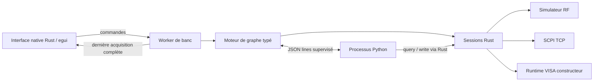

# Architecture

Objectif : assembler, exécuter et analyser un banc RF dans une interface manipulable pendant les acquisitions. Le cas de référence est une source à 2,45 GHz, un DUT, une acquisition de spectre, une compensation Python, une extraction de pic et un contrôle de limites.

## Dépendances des composants

| Crate | Responsabilité | Dépend de |
| --- | --- | --- |
| `rf-core` | Unités, trace, graphe DAG, ports typés, format de projet, résultats de test | Serde / thiserror |
| `rf-instruments` | ResourceManager, sessions, SCPI TCP, simulateur, VISA dynamique, blocs IEEE 488.2 | rf-core / libloading |
| `rf-runtime` | Worker, exécution, annulation, contrôle des sorties, supervision Python | rf-core / rf-instruments |
| `rf-dut-library` | Catalogue DUT versionné, validation, recherche et provenance des fiches | Serde / thiserror |
| `rf-workbench` | Schéma, navigation, inspecteur, historique, analyses dockables, Studio, aide/i18n, fichiers | Tous les composants précédents / eframe |

## Contrat d'exécution

Chaque bloc dispose de terminaux nommés, typés et indexés ; une sortie peut alimenter plusieurs consommateurs. Une seule source est acceptée par entrée. Les types couvrent RF, trace de spectre, puissance en dBm, analogique, numérique, modèle DUT, paramètres S, température, résistance et facteur de bruit. I/Q impose ses trois entrées I, Q et LO. Les connexions déterminent l'ordre topologique ; l'ordre d'affichage et les identifiants n'imposent pas l'exécution. Les cycles, indices invalides, entrées multiples, références absentes et ports incompatibles sont rejetés. Les entrées nécessaires doivent être reliées avant exécution. Les parcours manuels de câbles restent des coordonnées graphiques, sans influence sur le calcul.

Les valeurs du worker sont indexées par `(bloc, port de sortie)`. Les résultats séparent spectre dBm, magnitude/phase des paramètres S, forme d'onde avec unité FS/V et mesures scalaires avec unités. Le module `simulation` contient les modèles idéaux des nouveaux blocs ; il ne remplace pas les futurs profils matériels. Les ressources physiques de ces blocs sont refusées avant le premier envoi de commande.

Le générateur produit fréquence, niveau et provenance ; le DUT transforme le niveau théorique ; l'analyseur produit une trace simulée ou acquise selon sa ressource. Python transforme la trace et le moteur valide sa sortie. Le pic produit un scalaire ; le bloc limite produit un résultat PASS/FAIL. Les vues principales affichent la dernière acquisition complète ; le sélecteur de buffers permet d'inspecter les sorties des différents blocs et de choisir les données I/Q ou temporelles. Les prévisualisations de buffers sont bornées et ne remplacent pas les résultats complets.

Un démarrage prend une copie du graphe. Le worker possède les sessions : aucun accès instrument ni processus Python ne se déroule dans la boucle graphique. Un seul travail de banc est accepté à la fois. Les commandes et événements sont bornés ; les traces passent par un seul emplacement remplaçable. La consommation mémoire des acquisitions ne croît pas lorsque le rendu ralentit. L'arrêt utilise un drapeau atomique ; les transferts bloquants sont limités par le transport, pas interrompus arbitrairement au milieu d'une commande.

La boucle graphique dessine les blocs visibles et limite le nombre de points de courbe à un budget proportionnel aux pixels. La décimation conserve les extrema, afin de garder les pics étroits. Le rendu utilise la synchronisation verticale et se réveille lors des événements ; en cours d'acquisition, un rafraîchissement est demandé toutes les 16 ms. Ce sont des choix de conception, pas une garantie temps réel ni une preuve de 60 images/s pour des graphes arbitraires. Le mutex de résultat ne protège que le déplacement d'une trace complète.

## Contrat Python

Le worker lance l'interpréteur choisi avec un runner embarqué dans le binaire. Le script et la trace initiale sont envoyés sur stdin en JSON. La sortie stdout est réservée aux messages `query`, `write`, `result`, `error`. Rust traite les demandes d'instruments et répond sur stdin. Le script est limité à 100 opérations de passerelle ; les messages sont bornés à 4 Mo. Le processus est terminé et récolté sur les chemins de succès, erreur, arrêt et délai. Les processus descendants éventuellement lancés par le script ne sont pas gérés : ce n'est pas un bac à sable.

Python ne peut pas changer l'étiquette de provenance d'une trace simulée en donnée matérielle dans le chemin normal de résultat. La validation porte sur les données, pas sur l'exactitude du calcul utilisateur. L'environnement numérique appartient au métrologue et peut inclure NumPy, SciPy ou des librairies métier.

## Éditeur et Studio 0.3

`editor` applique les copies et transformations du graphe et cherche les parcours Manhattan autour des obstacles. Le calcul global de routage et l'organisation topologique tournent dans un thread dédié ; ils ne sont appliqués que si le graphe courant correspond encore à leur instantané initial. La grille est appliquée à la fin d'un déplacement ; les câbles automatiques sont recalculés, les coudes manuels restent explicites. L'historique est propre à chaque espace, sans limite fixe d'actions, et reste en mémoire pendant la session.

`studio` valide et sérialise les espaces, layouts, tailles/positions des vues, cadrage et préférences dans un fichier distinct du projet. Les résultats, buffers, waterfall et historiques utilisent `serde(skip)` : ils sont conservés au changement d'espace mais ne sont pas écrits sur disque. Les régions dockables utilisent des panneaux egui et des fenêtres flottantes ; le placement s'effectue par menus. La sauvegarde est atomique et explicite, sans récupération automatique après crash.

`rf-runtime::debug` capture les sorties effectives par `(bloc, port)` dans des buffers immuables partagés par `Arc`. Au plus 4096 échantillons par tableau et 512 ports sont prévisualisés. Les sondes sont prioritaires lorsque ce nombre est atteint. Le debug envoie des instantanés avant/après les blocs, dans un emplacement remplaçable ; un contrôle atomique continue ou exécute un bloc, et l'annulation est vérifiée pendant les pauses. Le mode refuse toute ressource physique avant d'exécuter le graphe. Le bloc Python reste un pas unique.

`analysis` représente les données avec leurs unités : waterfall d'acquisitions compatibles bornée, I/Q de cadence et unité communes, réflexion S11/S22 dans le Smith, repliement temporel de l'œil et seuillage du chronogramme. Les vues ne fabriquent ni trames, ni constellation QAM, ni indicateurs de synchronisation/calibration. `help` et `i18n` contiennent les fiches et libellés français/anglais ; les scripts, titres utilisateur et erreurs techniques sont conservés.

## Portabilité

Les crates de données et de sessions évitent l'API Windows dans leurs interfaces publiques. La façade VISA contient l'FFI, avec types fixes et durée de vie de la bibliothèque liée à celle des handles. Le masquage de fenêtre du processus Python est conditionné à Windows. L'application native egui est prévue pour Windows/Linux/macOS ; les variantes d'empaquetage et les dépendances système sont différentes.

Pour Android/iOS, partager d'abord `rf-core` et les composants de rendu, puis créer un hôte mobile pour le cycle de vie, les permissions et l'accès aux fichiers. Le pilotage devrait initialement passer par un agent de banc desktop distant, plutôt que de supposer la présence d'un runtime VISA ou de Python sur le téléphone. Le protocole distant, l'authentification et le transport chiffré restent à concevoir : aucun serveur réseau n'est exposé par cette version.

## Limites du prototype

Le moteur est séquentiel ; il n'inclut pas de boucles de programme, sous-schémas, branchements conditionnels ou scheduler temps réel. Les sessions VISA sont implementées mais non éprouvées sur le runtime constructeur de cette machine. Les drivers SCPI restent génériques. Le système ne fournit pas de budget d'incertitude, certificat de calibration, traçabilité ISO/IEC 17025 ni validation de conformité RF. L'historique contient le graphe et ses paramètres ; les résultats restent en mémoire et peuvent être exportés en CSV.
