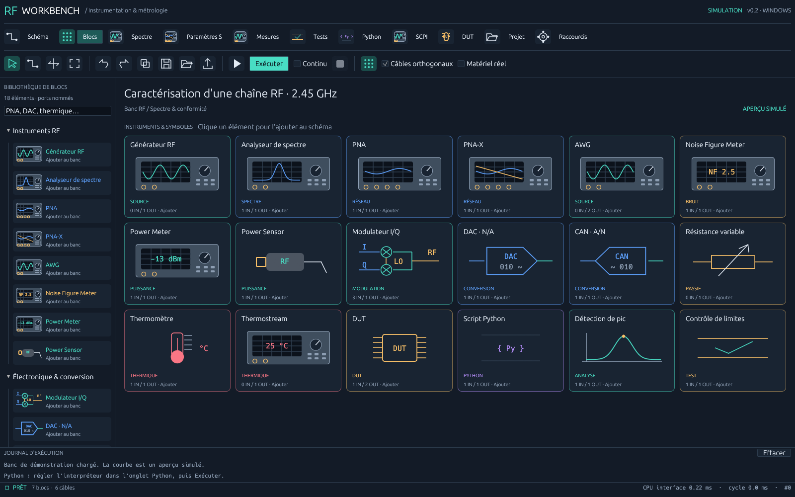

# RF Workbench 0.2 — blocs visuels et câblage

## Bibliothèque

La galerie **Blocs** et la palette à gauche proposent 18 éléments. Les illustrations sont dessinées en vecteurs par Rust/egui : façades d'instruments, puce DUT, mélangeurs I/Q, convertisseurs, résistance variable et sonde thermique. Elles restent nettes au zoom et ne nécessitent pas de chargement d'images externes.

| Bloc | Entrées de données | Sorties | Modèle actuel |
| --- | --- | --- | --- |
| Générateur RF | — | RF OUT | SCPI existant ou simulation |
| Analyseur de spectre | RF IN | TRACE | SCPI existant ou simulation |
| PNA / PNA-X | DUT optionnel | S-PARAM | Balayage simulé S11/S21/S12/S22, magnitude dB et phase ° |
| AWG | — | I, Q numériques | Sinus/cosinus quantifiés, fréquence et cadence réglables |
| DAC | DATA numérique | OUT analogique V | Conversion idéale, quantification et pleine échelle |
| CAN | IN analogique V | DATA numérique | Conversion idéale avec écrêtage et quantification |
| Modulateur I/Q | I, Q analogiques + LO RF | RF OUT | Transposition idéale à LO + fréquence de base, perte réglable |
| Résistance variable | — | R en Ω | Valeur réglable ; aucune simulation de circuit électrique |
| Thermostream | — | TEMP en °C | Consigne idéale, aucune dynamique thermique |
| Thermomètre | TEMP optionnel | TEMP en °C | Lecture de l'entrée ou valeur locale |
| Noise Figure Meter | DUT optionnel | NF en dB | Facteur de bruit du modèle DUT ou valeur locale |
| Power Sensor | RF IN | POWER en dBm | Niveau du signal simulé |
| Power Meter | POWER | POWER en dBm | Affichage de la valeur du capteur |
| DUT | RF IN optionnel | RF OUT + MODEL | Perte et facteur de bruit configurables ; modèle attachable au PNA/NF Meter |
| Python | TRACE | TRACE | Passerelle Python existante |
| Détection de pic | TRACE | POWER en dBm | Maximum du spectre |
| Contrôle de limites | POWER | POWER + résultat | Intervalle de puissance PASS/FAIL |

Les nouveaux profils matériels d'instruments ne sont pas implémentés dans 0.2. Ils refusent une ressource physique avant tout envoi de commande de banc. La console SCPI et la passerelle Python permettent de préparer des pilotes spécifiques. PNA et PNA-X sont deux blocs distincts, utilisant le même modèle de démonstration ; aucune option de mélangeurs, multiport physique ou calibration PNA-X n'est revendiquée. Les ports du schéma représentent les **données du programme**, pas les connecteurs coaxiaux ni un routage électrique automatique.

AWG → DAC I/Q → modulateur utilise deux séquences de même longueur, cadence et fréquence de base. Les DAC/CAN conservent la cadence d'entrée ; aucun rééchantillonnage n'est effectué. Les échantillons numériques sont normalisés (`FS`) ; les sorties DAC sont en volts. Les paramètres S sont séparés du spectre en dBm, pour éviter une confusion d'unités. Le modèle I/Q ne simule pas les défauts analogiques, les images spectrales ou une modulation numérique complète.

## Outils et raccourcis

La barre supérieure ouvre Schéma, Blocs, Spectre, Paramètres S, Mesures, Tests, Python, SCPI, DUT, Projet et Raccourcis. Les petites icônes commandent sélection, câblage, déplacement, cadrage, historique, duplication, fichiers, export, exécution, arrêt et grille.

| Raccourci initial | Action |
| --- | --- |
| W | Activer/désactiver le câblage |
| V / H / F | Sélection / déplacement / cadrage |
| F5 / Shift+F5 | Exécuter / arrêter |
| Ctrl+S / Ctrl+O | Enregistrer / ouvrir |
| Ctrl+Z / Ctrl+Y ou Ctrl+Shift+Z | Annuler / rétablir |
| Ctrl+D / Suppr | Dupliquer / supprimer |
| B / N / M | Galerie / paramètres S / mesures |
| Ctrl+K / Ctrl+E | Préférences / export spectre |
| Échap | Annuler le câble en préparation |

En mode W, cliquer une sortie puis une entrée. Cliquer le fond avant la destination pour ajouter des coudes. Les entrées compatibles sont mises en évidence ; un câble incompatible ne modifie pas le graphe. Le clic sur le corps d'un bloc fonctionne lorsqu'un seul port convient. En présence de plusieurs sorties ou de plusieurs entrées compatibles, choisir le port nommé. Les parcours sont sauvegardés dans le JSON et l'historique. Clic droit sur le câble : retirer ou réinitialiser le parcours. Le bouton de grille active l'aimantation des blocs ; le déplacement par glisser-déposer s'effectue en sélection, et le bouton H déplace le canevas.

Dans **Raccourcis**, saisir plusieurs combinaisons par action, séparées par des virgules, puis **Enregistrer les préférences**. Exemple : `W,Ctrl+Shift+W`. Les conflits, touches inconnues et Échap réservé sont refusés. Les préférences sont conservées dans `preferences.rfw.json`, dans le dossier de travail. Une combinaison vide désactive une action. Ctrl correspond à Cmd sur macOS. Les raccourcis de l'application restent suspendus pendant la saisie de texte.

Les palettes d'outils, le câblage annulable et les raccourcis personnalisables s'inspirent des [outils LabVIEW](https://www.ni.com/en/support/documentation/supplemental/08/labview-block-diagram-explained.html) et de ses [raccourcis](https://www.ni.com/docs/en-AS/bundle/labview/page/keyboard-shortcuts.html). La bibliothèque par familles s'inspire des [composants de conception système PathWave](https://www.keysight.com/nl/en/products/software/pathwave-design-software/pathwave-system-design-software.html). Les dessins et l'implémentation de ce projet sont propres à RF Workbench.

## Catalogue DUT

La crate `rf-dut-library` fournit un catalogue JSON versionné, validé et interrogeable. Les entrées initiales sont vides. Les fabricants prévus servent uniquement d'organisation : aucune caractéristique de puce n'a été inventée ou récupérée automatiquement.

Chaque fiche contient identifiant unique, fabricant, référence, famille, description, perte, facteur de bruit, attributs libres et sources (`url` HTTPS, `retrieved_on`). La vue DUT permet une recherche, l'ajout manuel, l'import/export JSON et la création d'un bloc depuis une fiche. Enregistrer les fiches dans `dut-catalog.json` pour les retrouver au lancement. La configuration attachée au bloc est un instantané ; modifier ensuite le catalogue ne modifie pas silencieusement les projets existants. Les futurs importeurs pourront remplir ce format après extraction et vérification des fiches constructeur.

## Démonstrations

Dans **Projet**, charger RF/spectre, PNA-X/DUT, AWG/DAC/I/Q ou thermique/puissance, puis Exécuter. Les trois dernières chaînes fonctionnent sans Python. Le banc I/Q donne une porteuse proche de 2,451 GHz et de -13 dBm. Les résultats réseau apparaissent dans Paramètres S ; les formes d'onde et mesures avec leurs unités apparaissent dans Mesures.

Les anciens projets 0.1 restent lisibles : les indices de ports absents valent zéro et les nouveaux paramètres reçoivent leurs valeurs par défaut. Un ancien exécutable ne sait pas interpréter les nouveaux types de blocs.

Les options de développement `--gallery`, `--settings`, `--demo-pna`, `--demo-iq`, `--run-demo`, `--results` et `--capture chemin.png` facilitent l'inspection du rendu natif. La capture attend plusieurs frames, enregistre le framebuffer puis ferme cette instance.
