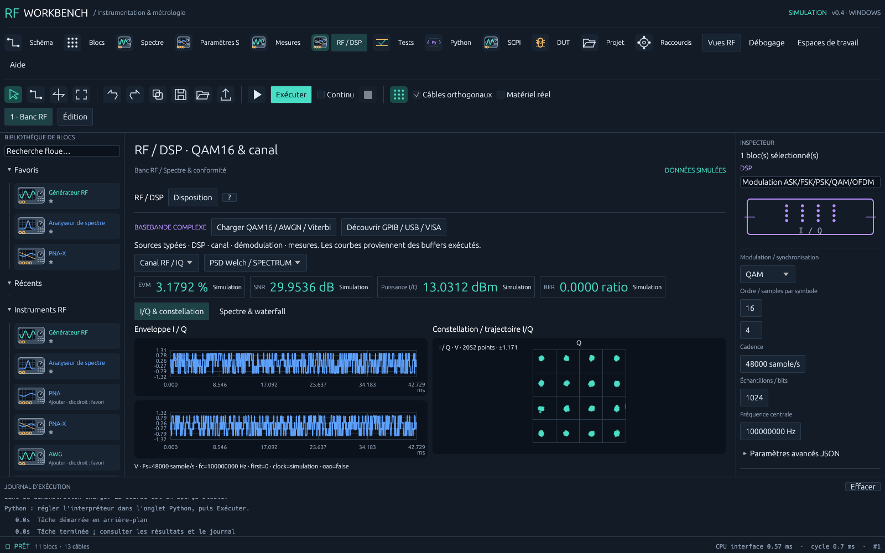
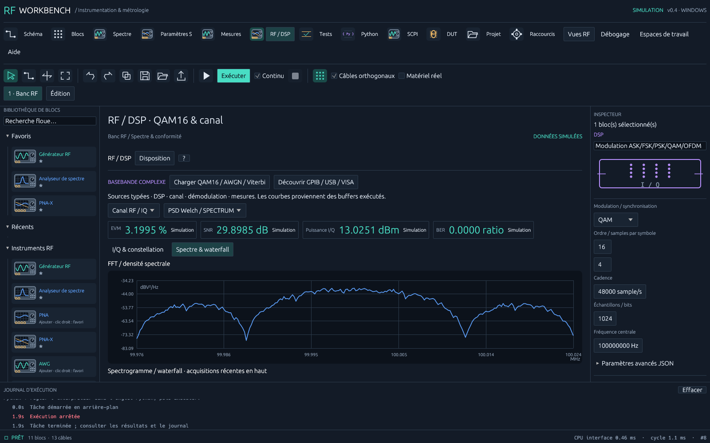
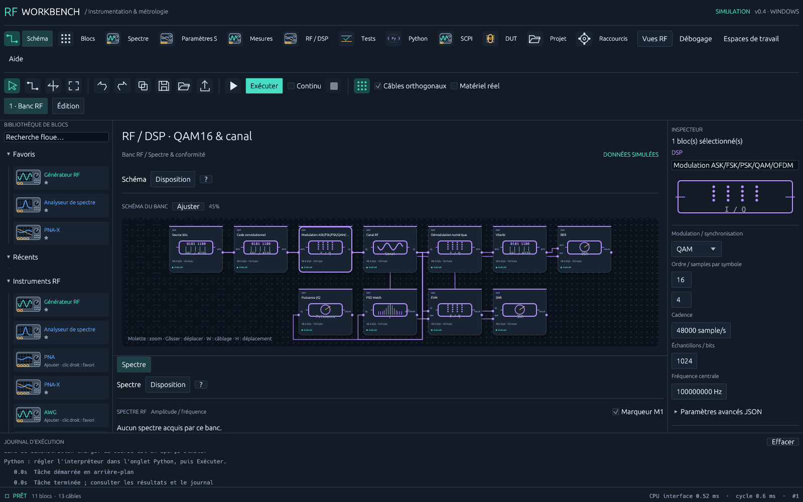

# RF Workbench 0.4 — RF, DSP et HAL

Cette version ajoute **45 opérations DSP/HAL** aux 18 blocs instruments : **63 types** dans la palette, la recherche, les favoris et le schéma. Le moteur traite réellement leurs données. Les algorithmes constituent des profils de recherche documentés ; ils ne sont pas qualifiés pour la métrologie ni présentés comme des modems normalisés.

## Essayer le banc

1. Ouvrir **RF / DSP**, puis **Charger QAM16 / AWGN / Viterbi**.
2. Cliquer **Exécuter** ou F5. Le graphe comporte source bits, convolutionnel, QAM16, canal AWGN, démodulation, Viterbi, BER, EVM, SNR, puissance et PSD.
3. À 30 dB de SNR demandé : BER = 0 sur les 1024 bits de cette acquisition ; EVM ≈ 3,18 %, SNR mesuré ≈ 29,95 dB. Ce sont des résultats simulés, dépendants de la seed et du nombre de bits, pas une garantie de BER.
4. Les sélecteurs de buffers choisissent la chaîne I/Q et le spectre. Les onglets internes **I/Q & constellation** et **Spectre & waterfall** gardent chaque analyse lisible. Le mode **Continu** accumule le spectrogramme/waterfall. La vue est dockable. Les points sont issus des acquisitions, y compris pendant le debug.
5. Ajouter un bloc dans la palette ou **Blocs**, câbler ses entrées obligatoires avec W. L'inspecteur expose les réglages courants et un éditeur JSON avancé avec validation avant application. F2 explique le bloc, ses formules et ses limites.

La commande `rf-workbench --demo-dsp --dsp --run-demo` ouvre ce banc ; `--headless-run --demo-dsp` l'exécute sans fenêtre et retourne les mesures JSON. `--benchmark --demo-dsp` mesure 1000 cycles sans rendu ni matériel.

## Opérations disponibles

| Domaine | Implémentation et limites |
| --- | --- |
| Sources/sinks | Sources complexes et bits, entrée/sortie HAL. RAW indexé, TCP/UDP natifs ; VISA/SCPI binaire ; adaptateurs Python SoapySDR, UHD, IIO AD9361, ZMQ et audio stéréo I/Q |
| DSP | FIR/IIR avec état, décimation/interpolation entières par FIR, FFT radix 2, Hann/Hamming/Blackman/rectangulaire, AGC. Les taps anti-alias sont à concevoir pour le facteur demandé |
| Synchronisation | PLL/Costas second ordre, Costas BPSK/QPSK ; Gardner interpolé par trame ; préambule exact ou inversé et extraction de paquets. Pas encore de timing fractionnaire continu ni de préambule traversant deux trames |
| Modems | AM/FM/PM ; ASK, FSK (ordre ≤ 16), PSK, QAM carrée 4/16/64/256 et OFDM. Pulses rectangulaires et timing connu ; QAM/PSK/ASK Gray, LLR max-log ; FSK fournit une confiance fixe après décision par corrélation |
| OFDM | IFFT/FFT N, CP N/8, QAM sur tous les bins. Ni pilotes, ni égaliseur, ni modèle Wi-Fi/5G implicite |
| Convolutionnel | K=3, générateurs (7,5) en octal, rate 1/2, terminaison de 2 bits zéro, Viterbi souple à 4 états |
| Reed–Solomon | GF(256), polynôme 0x11d, première racine α⁰ ; RS(255,255-p), p configurable 2..64 ; correction jusqu'à floor(p/2) octets. Blocs entiers, MSB-first, sans erasures. Au-delà de la capacité, toute erreur n'est pas détectable |
| LDPC | Profil systématique propre au projet (128,64), H=[A\|I], voisins r/r+7/r+23 ; min-sum normalisé 0,8, contrôle de syndrome et erreur de non-convergence. Aucun profil DVB/3GPP |
| Turbo | Deux RSC à 4 états, feedback 1+D+D², feedforward 1+D², rate 1/3, interleaver d'ordre inversé, max-log BCJR itératif. Non terminé, max. 8192 bits, sans profil 3GPP |
| Mesures | Puissance complexe RMS calibrée, SNR/EVM avec référence alignée, THD cohérente (harmoniques 2..10), BER/PER avec bits de référence, bruit de phase par PSD de phase, VSWR maximal sur S11/S22 |
| Analyse spectrale | FFT centrée par bin, Welch avec 50 % d'overlap, spectrogramme/waterfall et fréquence du pic discret maximal. Pas encore de liste de pics interpolés |
| Calibration | Moyenne DC, matrice gain/phase/DC I/Q, compensation de gain/phase porteuse du câble, table [Hz,dB,deg] à la fréquence centrale, facteur RMS `volts_per_fs` explicite ; pas d'extrapolation ni de retard fractionnaire d'enveloppe |
| Incertitudes | U=k·sqrt(sum(u²)) pour composantes indépendantes dans l'unité d'entrée. Pas de covariance, degrés de liberté ou propagation complète dans le graphe |
| Unités | Hz, dBm, dB, dBV/dBFS, V, A, W, s, sample/s, ratio, %, densités et dBc/Hz. Conversions RMS avec impédance, rapports de puissance, préfixes SI via `parse_quantity` ; conversion dimensionnelle impossible refusée |
| Canal | AWGN seedée, block fading Rayleigh, FIR multipath, rotation Doppler/offset et compression sans mémoire. Fading constant par trame ; aucun modèle normalisé de propagation |

## Conventions de mesure

`IqFrame` contient des échantillons complexes, Fs, fc, unité, provenance et `TimeTag` : premier indice, epoch optionnelle, domaine d'horloge et discontinuité. L'epoch appartient au domaine déclaré ; elle n'est pas automatiquement une date UTC. Un gap ou changement de paramètres remet à zéro les historiques de filtre/boucle. Les algorithmes DSP refusent NaN/infini et les tailles hors limites ; le modèle UI est une prévisualisation bornée à 4096 points.

L'amplitude complexe en **V** est définie ici comme une amplitude RMS : P=mean(|I+jQ|²)/R. Une amplitude crête RF ou des codes ADC requièrent un facteur de calibration explicite. Les adaptateurs SDR/audio/VISA I/Q produisent des données **FS**, pas des volts inventés. Le bloc **Table calibration**, avec `volts_per_fs`, permet une conversion calibrée FS→V. Le bloc puissance refuse FS tant que cette calibration n'a pas été fournie.

La PSD complexe deux côtés est |FFT(xw)|²/(Fs·sum(w²)), moyennée sur les segments. Son intégrale donne mean(|x|²). Ses niveaux sont référencés à V²/Hz ou FS²/Hz ; ils ne sont pas des dBm. FFT par bin est référencée à 1 V/1 FS et divisée par N, sans correction implicite de gain cohérent de fenêtre.

SNR/EVM comparent des trames de mêmes longueur, Fs/fc, unité, indices, domaine d'horloge et epoch. SNR=10log10(signal/error), EVM%=100sqrt(error/signal). Il n'y a pas d'alignement ni de correction implicite de phase/gain/retard. Une référence nulle ou un SNR infini donne une erreur explicite.

Le bruit de phase déroule arg(I+jQ), retire la tendance linéaire et calcule la PSD des fluctuations. L(f)≈Sφ,one-sided/2=Sφ,two-sided à faible modulation de phase ; le spectre conserve les offsets positifs en dBc/Hz. Cet estimateur n'effectue ni cross-correlation, ni correction du bruit de l'instrument. Voir les explications de [Keysight sur la phase noise](https://helpfiles.keysight.com/csg/89600B/Webhelp/Subsystems/wlan-mimo/content/trc_phase_noise_spectrum.htm).

Les familles d'algorithmes et leurs paramètres s'appuient notamment sur la documentation primaire de [liquid-dsp](https://www.liquidsdr.org/doc/index.html). Les profils FEC de ce dépôt sont décrits ci-dessus ; ils ne prétendent pas reproduire les profils normalisés d'une bibliothèque concurrente.

## Instrumentation — priorité GPIB et USB

**Découvrir GPIB / USB / VISA** lance `viFindRsrc` / `viFindNext` dans le worker ; aucun instrument n'est configuré par la découverte. Installer un runtime VISA du constructeur, ou définir `RF_WORKBENCH_VISA` vers sa bibliothèque de même architecture. La découverte retourne les ressources INSTR accessibles au runtime, y compris ASRL et LAN selon ses pilotes. Pas encore de découverte réseau multicast SDR ou de scans de ports.

| Backend | Chemin et dépendances |
| --- | --- |
| VISA | Sessions natives dynamiques : GPIB, USBTMC, ASRL, VXI-11/HiSLIP selon runtime. Textes et blocs IEEE 488.2 ; I/Q générique cf32 little endian, requête SCPI configurable. Configurer le format instrument avant la lecture |
| SERIAL | Ressource VISA `ASRLn::INSTR`, réglages du port dans le runtime/profil constructeur ; pas de pilote COM brut indépendant dans cette version |
| TCP / UDP | I/Q JSON avec métadonnées. TCP : longueur u32 big endian + JSON ; UDP : un datagramme JSON ≤ 60000 octets. TCP client ; UDP source bind et sink connect. SCPI TCP demeure un protocole distinct via ResourceManager |
| SOAPY | SDK SoapySDR Python + plugin du SDR + numpy ; RX/TX CF32, un canal, horloges rapportées par le pilote ; timestamp si HAS_TIME est présent |
| UHD | UHD Python du constructeur + numpy ; RX/TX USRP FC32/SC16, un canal ; clock source et timestamps RX du pilote |
| IIO | pyadi-iio + libiio + numpy ; AD9361 mono-canal uniquement. Échelles de codes déclarées : rx_scale=2048 et tx_scale=16384 par défaut, à valider selon le modèle/format DMA ; fréquence/cadence configurées ; pas de timestamps matériels |
| AUDIO | sounddevice/PortAudio + numpy ; deux canaux I/Q, cadence configurée, over/underflows signalés, pas de timestamp matériel |
| ZMQ | pyzmq + numpy ; source SUB / sortie PUSH, connect, une trame I/Q JSON par message, timeout et linger=0 |
| RAW | Natif, cf32 LE + sidecar JSON versionné ; append par acquisition, métadonnées/index par trame, seek/rejeu ; intégrité de taille/continuité vérifiée, sans checksum des données |
| HDF5 / Parquet | numpy+h5py / numpy+pyarrow dans l'interpréteur choisi. Schémas du projet, métadonnées par trame, lecture séquentielle et index du format ; refus d'écraser un fichier existant |

Le helper Python persiste pendant le banc. Les I/O et appels de SDK sont supervisés avec le timeout choisi, puis kill/reap en cas de blocage. La fermeture normale finalise les fichiers Parquet ; un arrêt forcé ou crash peut rendre un enregistrement incomplet. Le RAW accepte l'écrasement explicite à chaque nouvelle exécution d'une sortie ; choisir un chemin distinct pour préserver les mesures précédentes.

`rf-hal::InstrumentProfile` associe une classe (générateur, analyseur, VNA, oscilloscope, power meter, SDR), ressource, requête, format, timeout, reconnexions et capacités. `Instrument` expose des lectures ASCII typées (puissance, spectre, VNA RI, oscilloscope) et la configuration générique de fréquence/puissance. Les commandes, axes, unités et réglages propres à un modèle restent à valider. Les blocs instruments de 0.2 conservent leurs simulations ; les nouveaux blocs HAL utilisent les adaptateurs d'acquisition.

La reconnexion automatique bornée est disponible pour **l'identification `*IDN?`**. Les écritures et requêtes d'acquisition ne sont pas rejouées automatiquement : elles pourraient déclencher deux mesures ou deux actions. Les erreurs arrivent dans le journal. Le mode Matériel autorise les I/O physiques ; les fichiers restent utilisables en simulation. Aucun SDK SDR n'est nécessaire pour essayer le banc QAM.

**Synchronisation matérielle :** contrat explicite pour clocks, triggers, timestamps, PTP, GPSDO et nombre de canaux. Les adaptateurs fournis sont mono-canal et démarrent immédiatement ; Soapy/UHD peuvent sélectionner une horloge réellement rapportée. PTP/GPSDO/MIMO et déclenchements externes complets sont **des points d'extension, pas des pilotes validés**. Une demande non supportée échoue. La synchronisation d'horloge, d'epoch/PPS et de phase nécessite des mécanismes distincts ; voir le [manuel UHD](https://files.ettus.com/manual/page_sync.html).

## Streaming et limites actuelles

Acquisition réseau/SDR/audio/ZMQ sur worker séparé ; queue SPSC Rust sans mutex sur le chemin des trames, capacité 4. Une queue pleine abandonne la nouvelle trame, compte l'overflow et marque la prochaine trame acceptée discontinue. L'interface affiche les pertes. Les indices/timestamps conservés permettent au DSP de détecter les gaps. VISA et fichiers sont lus à la demande du graphe.

Le worker de banc publie le dernier résultat complet ; le rendu ne reçoit pas une file de vieux spectres. Le mode Continu du graphe conserve actuellement la cadence de rafraîchissement du prototype (pause ~250 ms), indépendante du débit d'acquisition. Ce fonctionnement **ne garantit pas un traitement sans perte à haut débit ni du temps réel dur**. Les adaptateurs Python utilisent JSON, impliquant copies et coût de sérialisation ; une ABI native/buffers partagés et un ordonnanceur streaming restent nécessaires pour les gros flux SDR.

## SDK et validation

Installer uniquement les backends nécessaires dans l'interpréteur choisi. Pour le stockage/réseau optionnels : `python -m pip install numpy h5py pyarrow pyzmq`. Pour SDR, utiliser les distributions constructeur : [SoapySDR Python](https://github.com/pothosware/SoapySDR/wiki/PythonSupport), [UHD Python](https://files.ettus.com/manual/page_python.html), [pyadi-iio buffers](https://pyadi-iio.readthedocs.io/en/latest/buffers/index.html). Les SDK manquants produisent une erreur, jamais une acquisition simulée présentée comme réelle.

Les tests Rust couvrent les calculs numériques, métadonnées RAW, échanges TCP/UDP, queue/overflow et graphe DSP. La CI ajoute des roundtrips HDF5/Parquet et ZMQ réels dans un environnement avec ces dépendances. Les profils GPIB/USB/SDR/audio restent à tester sur vos instruments : aucune connexion physique n'a été effectuée. Voir le [rapport de validation](VALIDATION.md).
